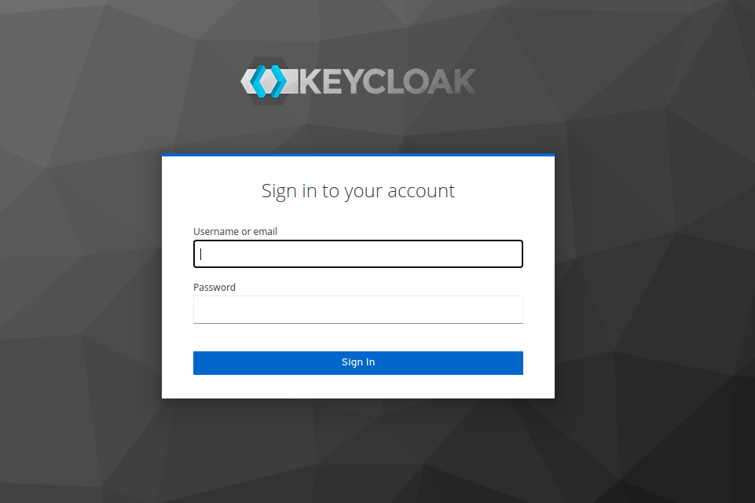
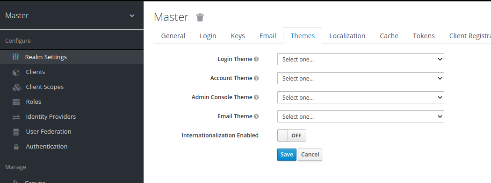

# {{ cookiecutter.project_slug }} Keycloak theme project

Keycloak is a popular open-source identity provider: [https://www.keycloak.org/](https://www.keycloak.org/)  

This is the Keycloak repository containing the _{{ cookiecutter.theme_title }}_ theme and extensions created
with Blueshoe's _keycloak-theme-template_ cookiecutter template 
([find it here](https://github.com/Blueshoe/keycloak-theme-template)).

## Getting started
Please consult the official Keycloak documentation for creating a theme 
[here](https://www.keycloak.org/docs/latest/server_development/#creating-a-theme).  
**Important:** for a version older than _latest_ you can find the associated 
documentation in the archive: 
[https://www.keycloak.org/documentation-archive.html](https://www.keycloak.org/documentation-archive.html) 

## Development

### Environment
Bring up the development environment with `docker-compose up`. It starts a `PostgreSQL` database and a Keycloak
instance.

Keycloak will now be available on http://localhost:8080. You can log into the `Administration Console` using 
_admin_ as both user and password.

The theme from {{ cookiecutter.theme_title }}/ will be mounted into the running Keycloak instance. Caching is already
deactivated.

### Theme and Realm
Keycloak provides the concept of realms. From their docs:  
> A realm manages a set of users, credentials, roles, and groups. A user belongs to and logs into a realm. Realms are isolated from one another and can only manage and authenticate the users that they control.  

Themes are also configurable for each realm. Please find more information [here](https://www.keycloak.org/docs/latest/server_admin/#core-concepts-and-terms).
During development, the default "master" realm might be enough to work with.

More on the theme configuration [here](https://www.keycloak.org/docs/latest/server_development/#configure-theme)

### Set up the realm
1) Login in at [http://localhost:8080/auth/admin/](http://localhost:8080/auth/admin/)

 

The default admin credentials are _admin_ as both user and password.

2) Go to the _Master realm_ theme settings  [http://localhost:8080/auth/admin/master/console/#/realms/master/theme-settings](http://localhost:8080/auth/admin/master/console/#/realms/master/theme-settings)

 

Select for the **Login Theme** from the dropdown ("Select one...") _{{ cookiecutter.theme_title }}_.
Do the same for other theme aspects if your template provides customizations.

Don't forget to hit the _Save_ button.

### Coding
The templates are written in the [_Apache FreeMarker_](https://freemarker.apache.org/) templating language.
You can create _drop-in replacements_ for the files from the original theme, 
for example `{{ cookiecutter.theme_title }}/login.ftl` to insert theme-specific markup. If your template does not render
because of templating errors (or other errors) you will get a status 500 page (you can customize this as well). Please
refer to the logs with `docker-compose logs keycloak` to see what is causing the error. 

> if you decide to override HTML templates bear in mind that you may need to update your custom template when 
> upgrading to a new release.

Changes to the CSS, Images, or the template files are immediately reflected. Just enter the view and find the results.
The official [creating-a-theme documentation](https://www.keycloak.org/docs/latest/server_development/#creating-a-theme)
will get you started.

### Frontend frameworks and pre-processing
CSS pre-processors or any other heavy frontend framework (like Vue.js or React) can be integrated, too. Just please
make sure that everything required (like weback _build_ output) or minified CSS is written to _{{ cookiecutter.theme_title }}/_
according to the specification.

## Testing Keycloak e-mails
The local Keycloak server includes MailDev, a mock SMTP server that you can use to receive and view Keycloak e-mails. It is available on <http://localhost:8081>.

To set up the local Keycloak server to send e-mails to MailDev:

1. Log in to [the local Keycloak server](http://localhost:8080).
2. Go to the _Email_ tab in _Realm Settings_
3. Enter the following details:

    - Host: **maildev**

    - From: **keycloak@keycloak**

4. Click on _Save_
5. Click on _Admin_ in the top-right-hand corner of the page, and click on _Manage Account_
6. Add an e-mail address to the admin account.

    It doesn’t matter what e-mail address you add, as all e-mails will be caught by MailDev. But you do need to add one, otherwise Keycloak will not send e-mails for this account.

The local Keycloak server should now be set up to send e-mails to MailDev. To check that it’s working:

1. Click on the _Back to Security Admin Console_ link
2. Click on the _Login_ tab in _Realm Settings_
3. Enable _Forgot password_, and click on _Save_
4. Sign out.
5. On the Keycloak log in screen, click on the _Forgot your password?_ link
6. Enter your username (**admin**) in the text field, and submit the form.
7. Visit [MailDev](http://localhost:8081). You should see a reset password e-mail from Keycloak.

## Releasing
Build the Keycloak Dockerfile and push it to the registry from which your production environments deploy.
